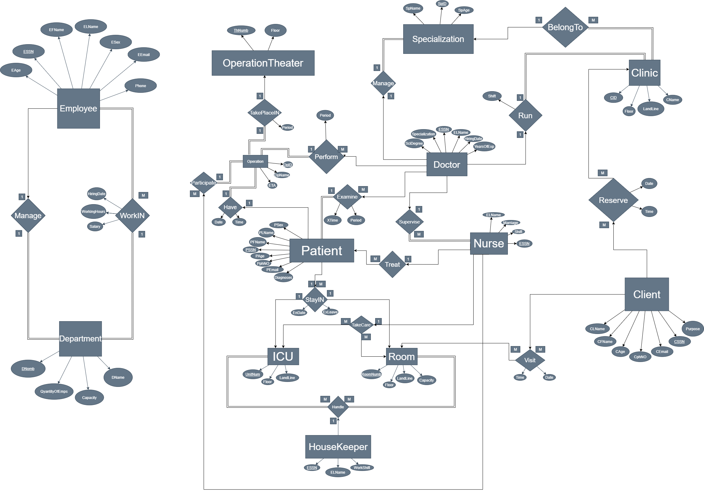

# Hospital Database Design and Implementation

## Project Description

This project involves the design and implementation of a comprehensive hospital database to manage various aspects of a hospital's operations, enabling efficient organization and streamlined management processes.
The database stores information about patients, employees, departments, medical specializations, intensive care units, clinics, operations, reservations, visits, and more.
The goal is to create an efficient and organized system to streamline hospital management processes.

## Project Features

- **Entities**: The database includes entities like patients, employees (including doctors, nurses, and housekeepers), departments, rooms, operations, clinics, intensive care units, and more.
- **Relationships**: Various relationships are established, such as patients being treated by doctors, employees managing departments, nurses taking care of rooms, doctors performing operations, clients reserving clinic appointments, and more.
- **Data Integrity**: The database enforces data integrity through primary key constraints, foreign key relationships, and appropriate data types.
- **Queries**: The project provides a set of queries to extract relevant information from the database, aiding in hospital management tasks.
- **ER Diagram**: The entity-relationship diagram visually represents the structure of the database, highlighting entities, attributes, and relationships.

## Project Files

- [ERDiagram.png](ERDiagram.png): The ER diagram representing the relationships and structure of the hospital database.
- [Hospital-DB-Design.pdf](Hospital-DB-Design.pdf): A presentation showcasing the project's design and implementation details.
- [HospitalDBSQL.sql](HospitalDBSQL.sql): SQL code for creating the database, tables, and defining relationships.
- [Required Queries.docx](Required%20Queries.docx): Document containing queries that can be executed on the database.
- [Required Queries.sql](Required%20Queries.sql): SQL file containing the implementation of the required queries.

## Project Relationships and Business Rules

The project incorporates the provided relationships and business rules to ensure a coherent and functional database structure. This includes managing doctors, nurses, housekeepers, patients, clinics, operations, appointments, and more according to hospital management best practices.

## How to Use

1. Review the ER diagram in [ERDiagram.png](ERDiagram.png) to understand the database structure.
2. Explore the presentation [Hospital-DB-Design.pdf](Hospital-DB-Design.pdf) for a comprehensive overview of the project.
3. Use the SQL code in [HospitalDBSQL.sql](HospitalDBSQL.sql) to create the database, tables, and relationships.
4. Execute queries from [Required Queries.sql](Required%20Queries.sql) to retrieve specific information from the database.

## Note

This project was developed as a graded assessment for a Databases course at the university. It showcases a robust hospital database design and implementation that can be used as a foundation for managing hospital operations.

For a clearer version of the ER diagram, you can access it [here](http://bit.ly/3b83tZn).

For more details about the project and its components, refer to [Hospital-DB-Design.pdf](Hospital-DB-Design.pdf) and the provided SQL files.

---

Feel free to explore the project's components and utilize the provided resources for managing hospital-related data effectively.

## No Limitation or Issues

This project has been designed with careful consideration of various scenarios and business rules. However, like any complex system, it may have limitations or issues that can arise during practical usage. Developers and administrators are encouraged to review and adapt the system as needed based on real-world requirements.

## License

This project is licensed under the [MIT License](LICENSE.md). Feel free to use, modify, and distribute the code and resources as per the terms of the MIT License.

